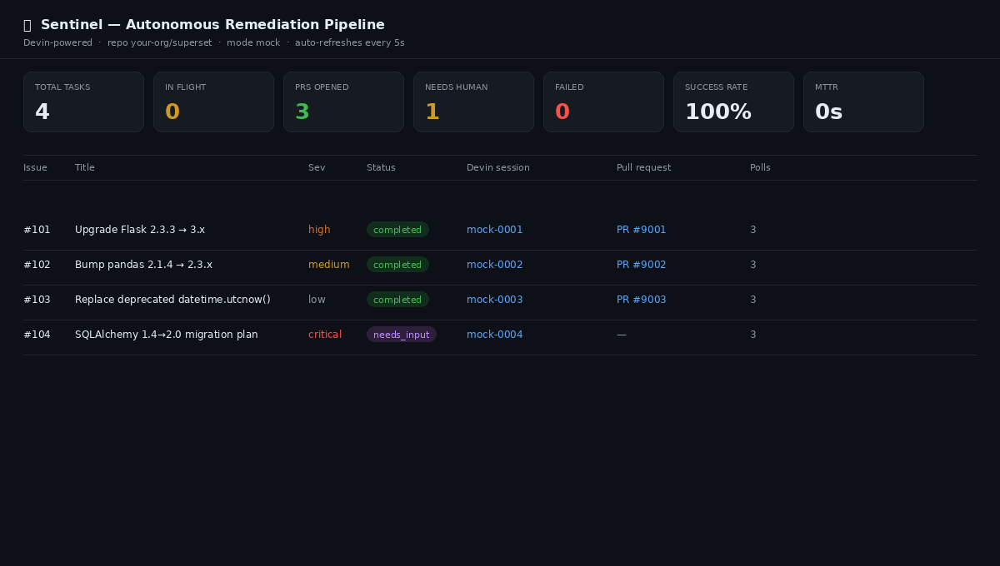

# 🛡️ Sentinel — Event-Driven Autonomous Remediation, powered by Devin



Sentinel closes the loop on security & dependency hygiene **without a human in
the critical path**:

```
  scan / Dependabot alert ──▶ file GitHub issue ──▶ Devin session ──▶ pull request ──▶ dashboard
        (event source)          (trigger)           (autonomous fix)    (observable output)
```

A dependency scan (or a GitHub webhook) is the **event**. For every finding,
Sentinel programmatically opens a **Devin** session with a precise remediation
brief, tracks that session to completion, captures the resulting **pull
request**, and surfaces everything on a live **dashboard** with success rate,
throughput, and mean-time-to-remediation.

Devin is the **core primitive**, not a helper: it reproduces the issue, writes
the fix, runs the repo's tests, and opens a reviewable PR — the work a human
engineer would otherwise do by hand.

---

## Why this matters (the VP pitch)

A mid-size org running dozens of services drowns in Dependabot/security alerts.
Today each one either rots in a backlog or burns a senior engineer's afternoon:
read advisory → bump version → fix what broke → run tests → open PR. Tools like
Dependabot/Renovate open the PR but leave the *fixing* to you.

**Sentinel turns that backlog into an unattended workflow.** Devin sits exactly
in the gap those tools can't fill — it runs the tests, reads the failures, fixes
the breakage, and hands back a PR a human only has to *review*, not author.

> "If I were an engineering leader, how would I know this is working?"
> → Open `/dashboard`: PRs opened, success rate, MTTR, and what's in flight — live.

---

## Quickstart (zero credentials, mock mode)

The default mode simulates the full Devin + GitHub lifecycle in-process, so you
can run the entire pipeline end-to-end with **no API keys and no network**.

```bash
# Option A — one-shot CLI demo (deterministic, great for the Loom)
make install
make demo          # scan → dispatch → poll to completion → print metrics

# Option B — the live service + dashboard
make serve         # http://localhost:8000
curl -X POST localhost:8000/scan        # file issues + dispatch Devin sessions
open http://localhost:8000/dashboard    # watch it work, auto-refreshes

# Option C — Docker
make docker-up                          # service on :8000 (mock mode)
make docker-demo                        # run the CLI demo in the container
```

Run the tests (the full pipeline, mocked, no network):

```bash
make test          # 5 passing end-to-end tests
```

---

## Going live (real Devin + real Superset fork)

1. **Part 1 — fork & seed issues.** Fork `apache/superset` into your org, then:
   ```bash
   cp .env.example .env        # fill in GITHUB_TOKEN + TARGET_REPO
   make issues                 # files the findings as labelled GitHub issues
   ```
2. **Switch to live mode** in `.env`:
   ```ini
   SENTINEL_MODE=live
   DEVIN_API_KEY=apk_xxx       # from app.devin.ai/settings
   GITHUB_TOKEN=ghp_xxx
   TARGET_REPO=your-org/superset
   ```
3. **Trigger it.** Either point a GitHub webhook (Issues events) at
   `POST /webhooks/github`, or run `make scan` to drive it manually. Devin
   sessions open real PRs against your fork; watch them on `/dashboard`.

> **The one thing only you can validate:** flip to live mode and run a single
> session against your fork to confirm your API key + the Devin endpoint shape
> match your enterprise environment. Everything else is exercised in mock mode.

---

## Endpoints

| Method & path           | Purpose                                            |
|-------------------------|----------------------------------------------------|
| `POST /webhooks/github` | Real GitHub `issues` webhook (HMAC-verified)       |
| `POST /scan`            | Run the scanner → file issues → dispatch Devin     |
| `POST /simulate`        | File one synthetic issue and dispatch (demo)       |
| `POST /poll`            | Force one tracker poll cycle (demo/CI)             |
| `GET  /status`          | JSON of every task                                 |
| `GET  /metrics`         | Analytics: success rate, MTTR, throughput          |
| `GET  /dashboard`       | Live HTML dashboard                                |
| `GET  /healthz`         | Liveness                                           |

---

## How it works

See [`ARCHITECTURE.md`](./ARCHITECTURE.md) for the full design. In short:

- **`scanner.py`** — event source. Reads Dependabot-style findings and files one
  labelled GitHub issue per finding (filing the issue *is* the trigger).
- **`orchestrator.py`** — turns a qualifying issue into a managed Devin session
  with a structured-output contract; idempotent so duplicate deliveries can't
  double-spend credits.
- **`poller.py`** — background tracker that maps Devin's granular session states
  onto a simple task lifecycle, captures the PR, and comments back on the issue.
- **`metrics.py` + `/dashboard`** — the observability surface.
- **`devin_client.py` / `github_client.py`** — each ships a real client and an
  in-process mock behind one interface, which is what makes the whole thing
  demoable and testable with zero credits.

## Design choices (and the cuts I made on purpose)

- **SQLite + async, no queue/Redis.** Single-process is the right size for this;
  the abstractions are visible, not buried in infra.
- **One prompt template, not a registry.** The remediation brief in `prompts.py`
  carries explicit guardrails (scope to one issue, open a PR, run tests, escalate
  if risky) — the same constraints you'd give a junior engineer.
- **Structured output over text-scraping.** Devin returns
  `{outcome, pull_request_url, summary, ...}` so the orchestrator never parses
  prose to learn what happened.
- **Mock mode as a first-class citizen.** De-risks the demo and lets reviewers
  run everything instantly.

## Repository layout

```
sentinel/        the pipeline (config, store, clients, orchestrator, poller, metrics)
templates/       dashboard.html
scripts/         bootstrap_superset_issues.py, simulate_event.py
data/            sample_findings.json
tests/           end-to-end pipeline tests (mock mode)
Dockerfile, docker-compose.yml, Makefile
```
